# Welcome to Yent-Connect!

## Intro
Yent-Connect is a dynamic and engaging web application built on the powerful combination of Ruby on Rails and React. Drawing inspiration from popular social media platforms like Instagram and Twitter, yent-Connect offers users a vibrant space to connect, share, and have a great time.

## Key Features
**User Profiles:** Create your personalized profile to showcase your interests and personality.
**Posts:** Share your thoughts, photos, and updates with the community through visually appealing posts.
**Follow System:** Build your social circle by following other users and keeping up with their activities.
**Messaging:** Connect with friends through direct messaging for private conversations.
**Comments and Likes:** Engage with the community by commenting on posts and expressing your appreciation through likes.
**Explore Feed:** Discover new content and interesting profiles through a curated explore feed.
**Screen Adjustment:** Yent-Connect is designed with a responsive layout that automatically adjusts to support both mobile and browser viewing modes. Whether you're on the go or relaxing at your desktop, enjoy a seamless experience as the interface adapts to provide optimal usability and visual appeal.

## Starting it up
**Backend**

Clone the repository and open it in your terminal, then Run:
`$ bundle install` or `$ bundle i`

Once your dependencies are installed, run:
`$ rails db:migrate`

Then run:
`$ rails server` or `$ rails s`

This will start up the Backend (Rails) server.

To quit the server, press CTRL + C.

**Frontend**

In a new terminal run: 
`cd client`

Then run:
`$ npm install` 

Then run: 
`$ npm start --prefix client`

This will start up the Frontend server.
You will then be taken to the browser to start using the application.

To quit the server, in the same terminal press CTRL + C.

## How it works
Instantly, you will be brought to the Welcome Page, where you can either Login or Signup. if you already have an account, simply Login, if you don't, join the club by pressing the Signup button. 
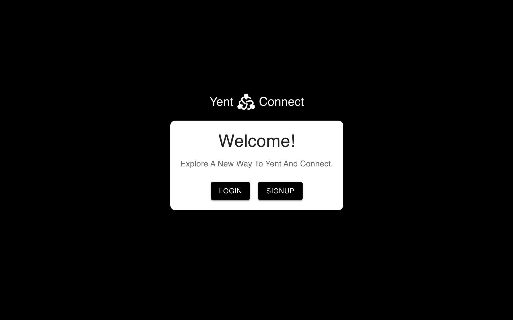
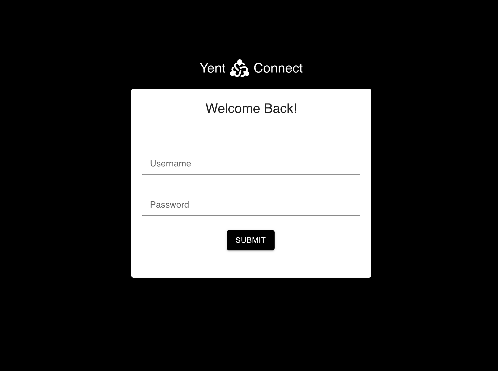
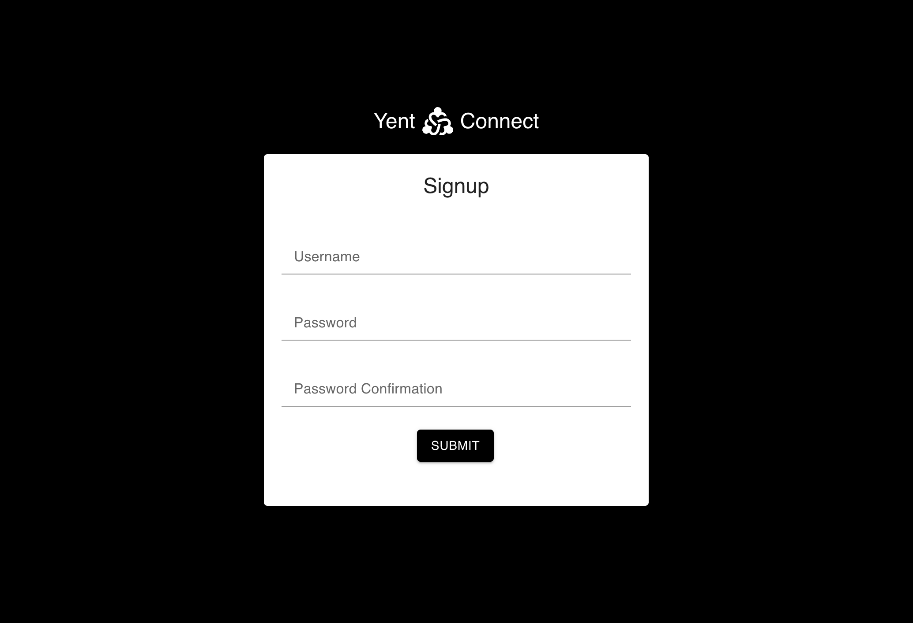

Once logged in you will be brought to the home page where you will be able to see all your posts and your friends posts. Additionally you will have the option to explore posts from users you don't follow.
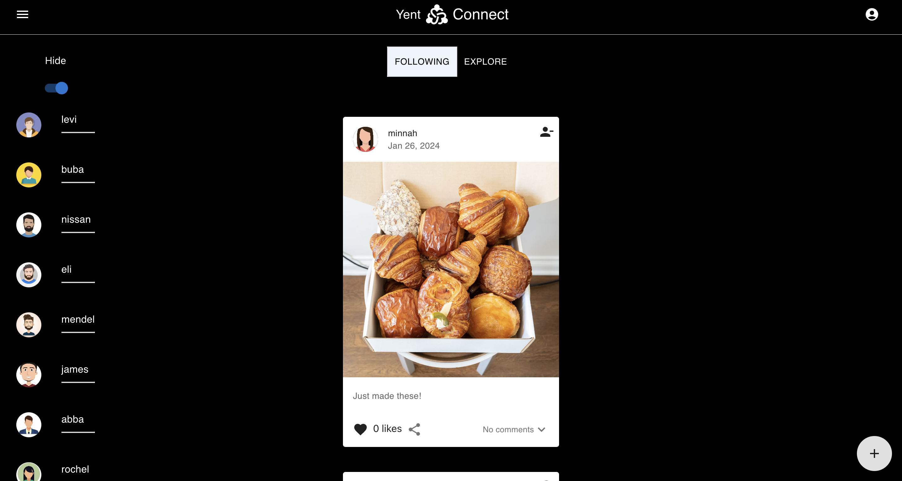
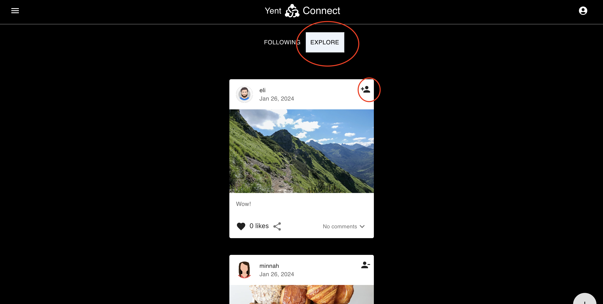
You can toggle "Hide" to hide all users. Once all users are hidden you'll have the option to toggle "See who to follow.

# Commenting on posts

# Liking posts
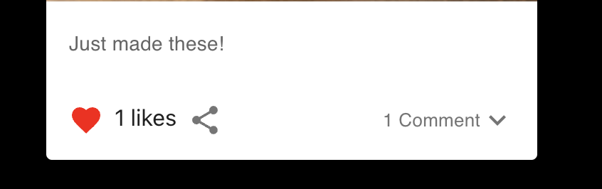

# Creating post
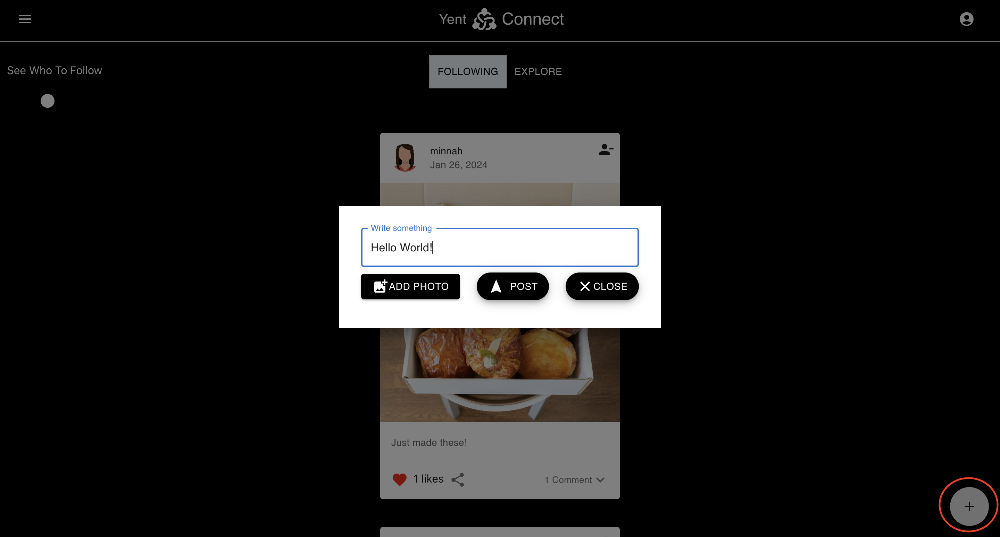

# Profiles
Click on profile icon which is located on top right corner of page.
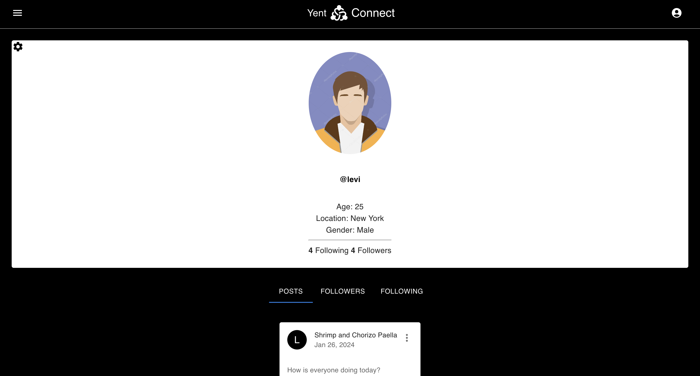

To View all other users profiles simply click on their profile photo anywhere in the application.
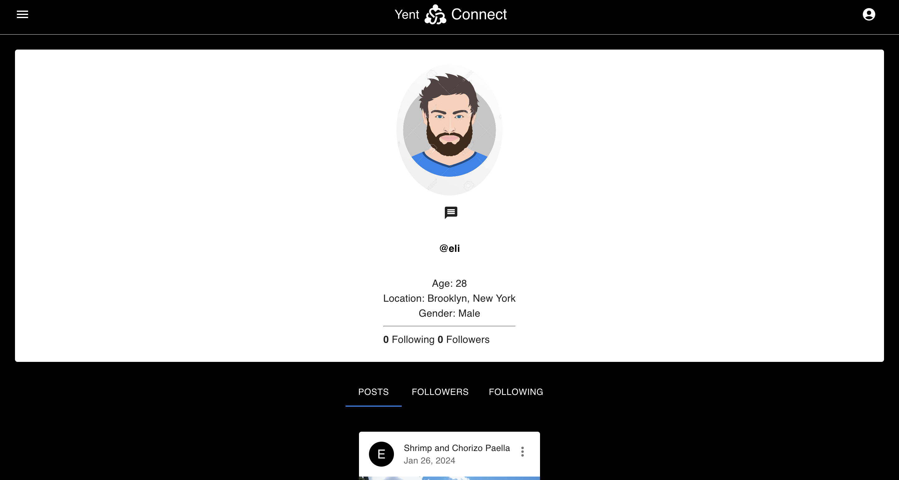

Toggle through users page to view their posts, who they are following, and who follows them.
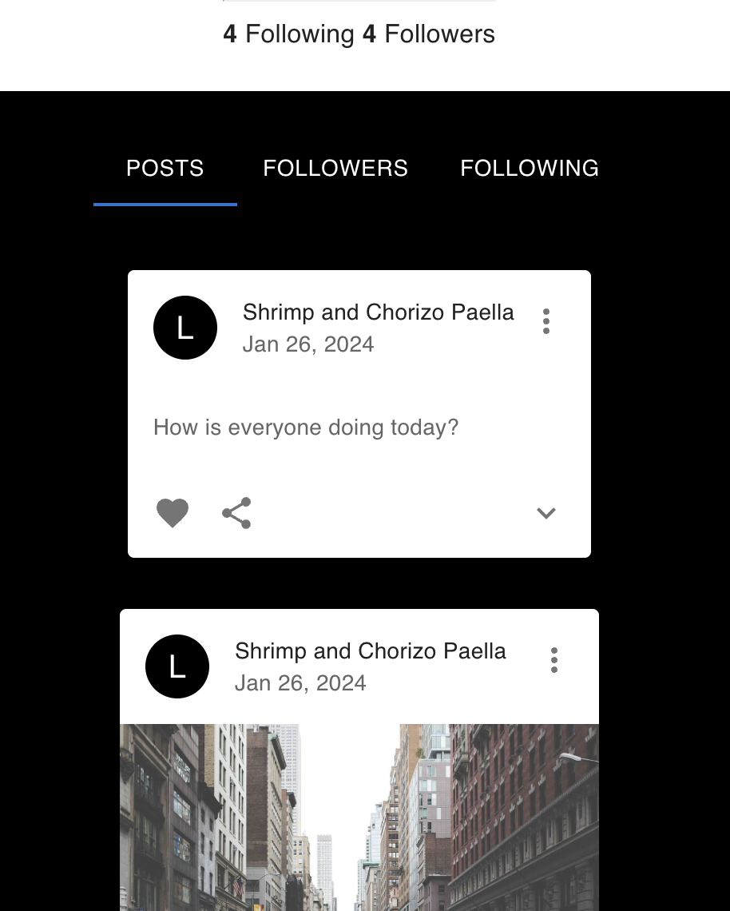
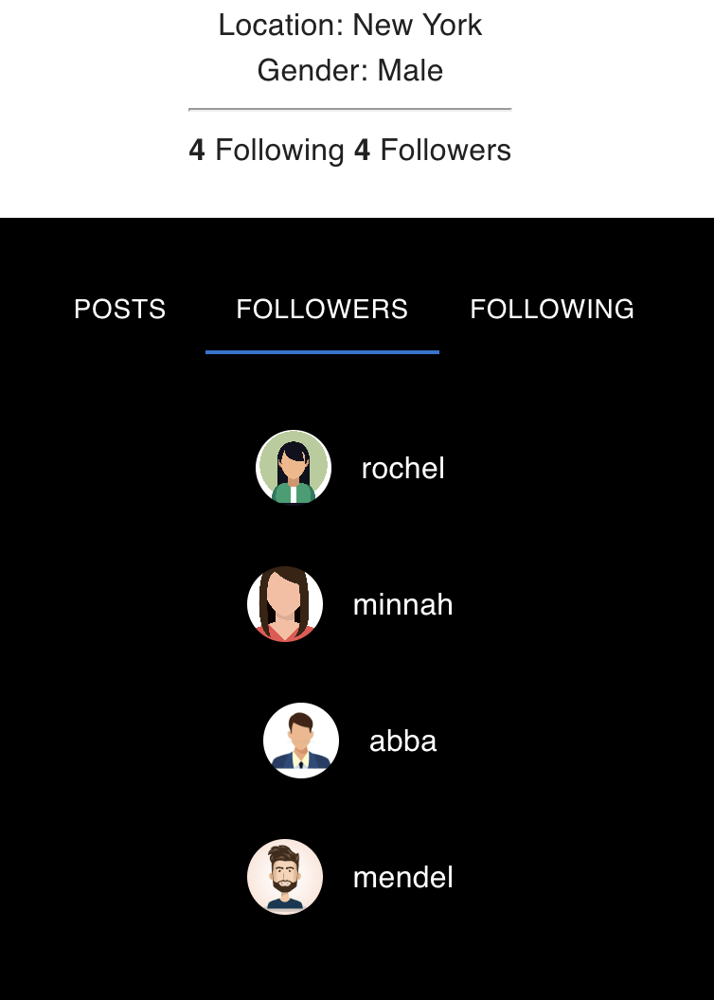

# Settings
Click settings icon which is located at top left corner of profile page to view your settings page.

Here you're able to change what ever settings you like. Additionally you can change your sex, location and profile photo.
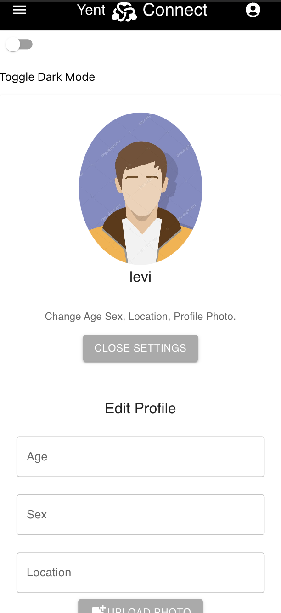

# Messaging
To message a user simply navigate to their profile page and click on the message icon.
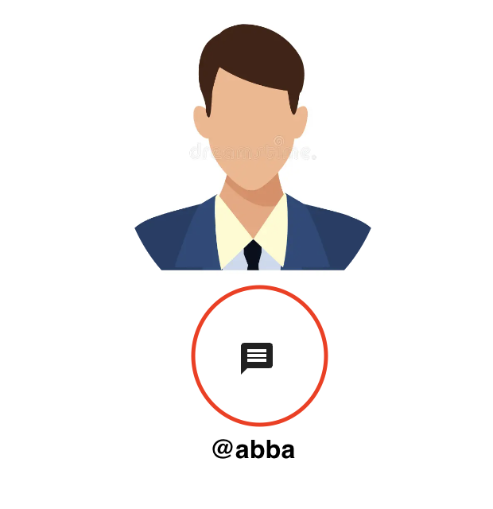

Once clicked a pop-up will appear.
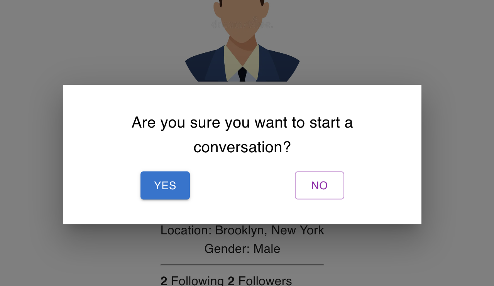

Once you click yes you'll be sent to the chat page.
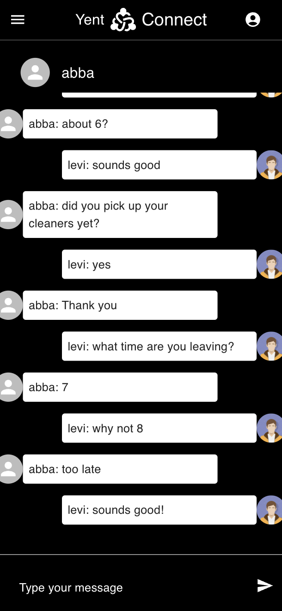

